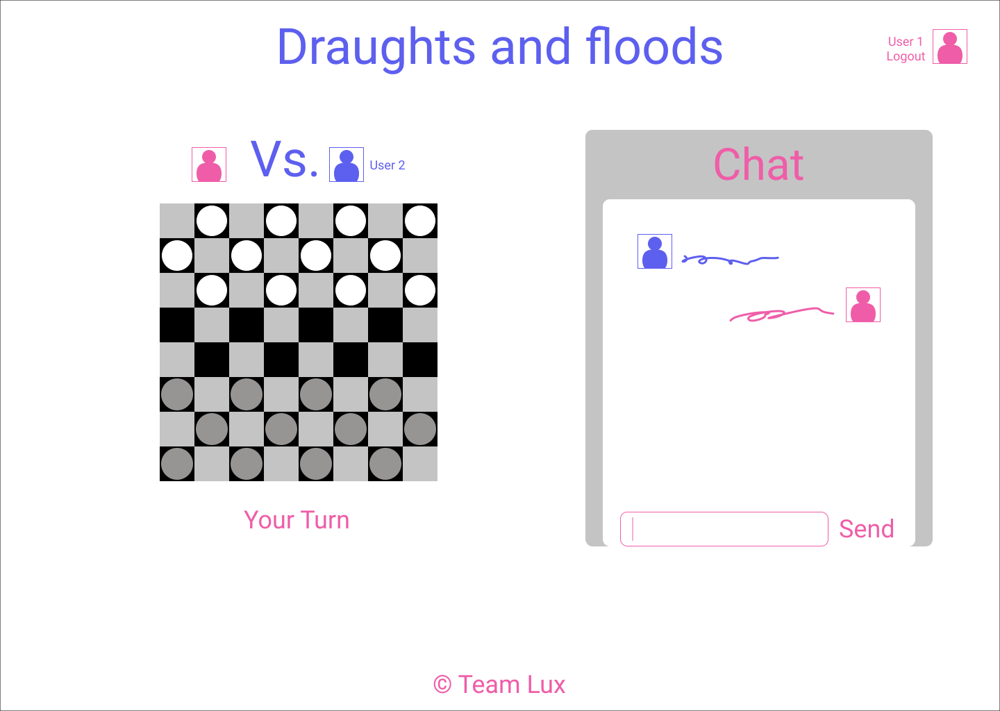

# _`Draughts and Floods`_
---
## `Objectives`
- To write a web app that implements different tech stacks
- To develop an MVP for an app, in the time available, that proves we can learn and develop new technologies ourselves
- To enhance our portfolios with a stand-out app
- To have some additional features that can be added to the completed MVP to prove we are able to 'manage' the development of an app and not just 'write an app'
---
## `Anti-Goals`
- An original app
- A marketable app; the time is not available
---
## `The Game` - _Main Screen_

--
- 2 players play draughts agianst each other from their own computers
- Initially, move the pieces by selecting the piece to be moved and then it's final location
- Incorporate a chat screen
- If time, add functionality to 'drag and drop' the pieces and animation
---
## `New Technologies`
- Learn how to display a background board on the screen and have pieces move over the top of the board using mouse clicks and eventually drag and drop
- Learn how to have interactivity between 2 remote players by sending the co-ordinates of each piece to the other players in real time using a back-end server
- Learn how to use Firebase messaging system
- Learn how to use Firebase authentication system
- Learn how to use Firebase hosting
---
## `Front End Development`
--
The Base Layout:
----------------
* Develop a background screen comprising a grid
* Develop a score counter the number of games won
* Develop a login system so only logged in players can play the game
* Develop a login screen and validation
--
Link to the Back-End
---------------------
* Send the x, y co-ordinates of each of the pieces to the back-end, each time a move is implemented
* Receive the co-ordinates of the pieces as they change including our own before rendering
* The back-end should keep track of the valid moves, and who might have won.
---
## `Back End Development`
--
* Develop a login system so logged in players can play against each other remotely
* Create a system for delivering the object containing the piece co-ordinates once a move is completed
* Keep track of the scores for each character playing
---
# This was Draughts and Floods